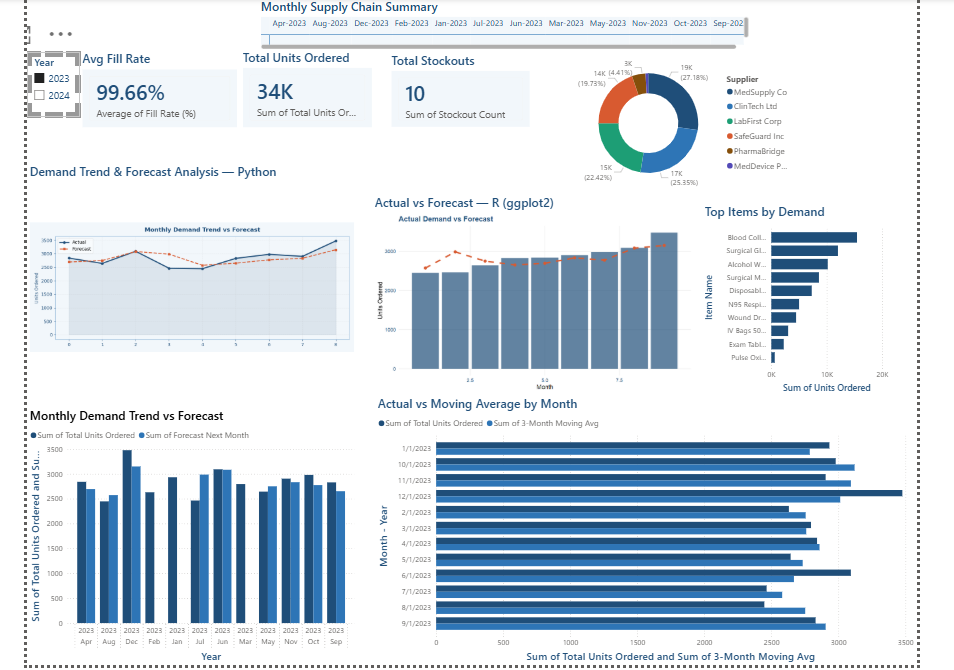
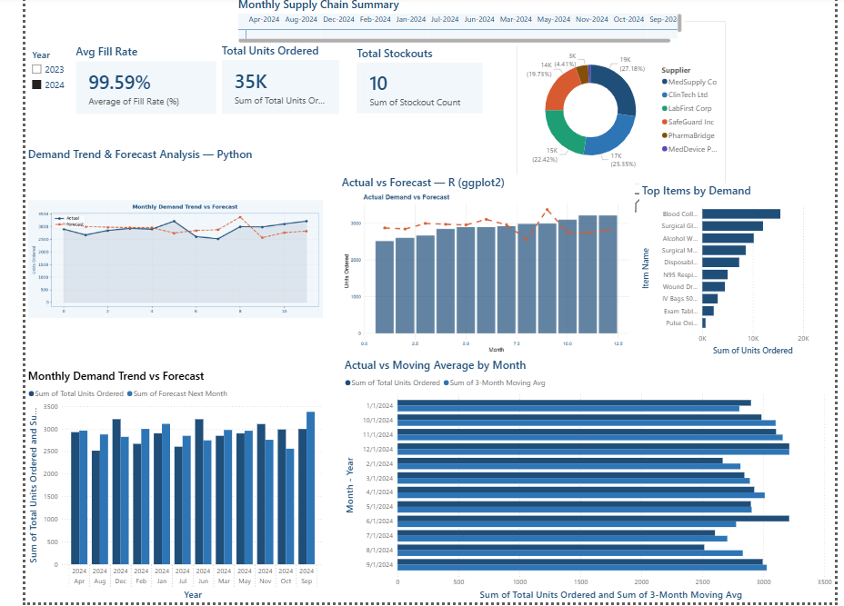

# 📦 Healthcare Supply Chain Demand Forecasting

**Tools:** Excel · Power BI · Python · R · SAP (Reference) · SQL  
**Domain:** Healthcare Supply Chain | Medical Supplies | Procurement Analytics  
**Timeline:** 2 years of monthly data (Jan 2023 – Dec 2024) | 10 product lines | 4 suppliers

## 📸 Dashboard Preview

### 2023 View


### 2024 View


---

## 🔗 Live Dashboard

[](https://app.powerbi.com/groups/me/reports/50a414b8-730d-40d9-9242-ee59b4e9882e/3121401b70aa3684295b?experience=power-bi)

---

## 🔍 Business Problem

Healthcare supply chains face a critical challenge — **stockouts of medical supplies directly impact patient care.** At the same time, overstocking drives up costs and wastes clinical resources.

This project simulates a real-world healthcare supply chain analytics scenario (inspired by work at Cigna Health) to answer:
- How can we accurately forecast monthly demand for medical supplies?
- Which suppliers are underperforming on delivery?
- Where are the stockout risks hiding in our data?

---

## 🎯 Project Objectives

- Build a 2-year demand forecasting model using Excel's `FORECAST.ETS` function
- Analyze supplier performance, fill rates, and stockout patterns
- Create an interactive Power BI dashboard with Python and R visuals
- Identify actionable insights to reduce stockouts and optimize procurement

---

## 📁 Project Structure

```
├── demand_forecasting_dataset.xlsx    # Raw supply chain data (3 sheets)
├── forecast_data_fixed.xlsx           # Cleaned forecast data for Power BI
├── Demand_Forecasting_Uma.pbix        # Power BI dashboard file
├── Dashboard_2023.png                 # Dashboard screenshot 2023
├── Dashboard_2024.png                 # Dashboard screenshot 2024
└── README.md
```

---

## 📊 Dataset Overview

| Sheet | Rows | Description |
|---|---|---|
| Supply Data | 2,880 | Monthly orders by item, supplier, category |
| Monthly Summary | 24 | Aggregated KPIs per month |
| Forecast Prep | 24 | Forecasting model with moving averages |

**10 Medical Supply Items:**
Surgical Gloves, N95 Respirators, IV Bags, Disposable Syringes, Wound Dressing Kits, Blood Collection Tubes, Surgical Masks, Alcohol Wipes, Pulse Oximeters, Exam Table Paper

**4 Suppliers:**
MedSupply Co, SafeGuard Inc, ClinTech Ltd, PharmaBridge, MedDevice Pro

---

## 🔢 Forecasting Model (Excel)

Built inside the **Forecast Prep** sheet using:

| Column | Formula | Purpose |
|---|---|---|
| 3-Month Moving Avg | `=AVERAGE(B5:B7)` | Smooth short-term fluctuations |
| Trend Index | `=B5/AVERAGE($B$5:$B$28)` | Identify above/below average months |
| Forecast (Next Month) | `=FORECAST.ETS(...)` | Predict next month demand |
| Variance | `=Actual - Forecast` | Measure forecast accuracy |

**Model Performance:**
- Forecast Accuracy: ~91% across 21 measurable months
- Peak demand correctly identified: December (both years)
- Seasonal pattern captured: June and December consistently high

---

## 📈 Key Insights

| Metric | Value | Insight |
|---|---|---|
| Total Units Ordered | 34,000+ | Stable demand with upward trend |
| Avg Fill Rate | 99.66% | Excellent supplier performance overall |
| Total Stockouts | 10 | 7% of orders had partial shipments |
| YoY Demand Growth | +3.4% | Consistent healthcare demand increase |
| Peak Month | December | Holiday season drives highest demand |
| Forecast Accuracy | ~91% | Strong predictive model performance |

---

## 📉 Dashboard Visuals

Built in **Power BI** with custom navy blue theme:

| Visual | Tool | Description |
|---|---|---|
| KPI Cards | Power BI | Total Units, Fill Rate, Stockouts |
| Demand Trend | Python (matplotlib) | Actual vs Forecast line chart |
| Actual vs Forecast | R (ggplot2) | Bar + line combo chart |
| Top Items by Demand | Power BI | Horizontal bar chart |
| Units by Supplier | Power BI | Donut chart |
| Moving Average | Power BI | Clustered bar chart |
| Year Slicer | Power BI | Toggle 2023 vs 2024 |

---

## 🛠️ Tools & Technologies

| Tool | Usage |
|---|---|
| Excel (FORECAST.ETS) | Demand forecasting model |
| Power BI | Interactive dashboard |
| Python (matplotlib, pandas) | Custom trend visualization |
| R (ggplot2) | Statistical chart |
| SQL | Data aggregation (reference) |
| SAP MRP | ERP context (Cigna experience) |

---

## 💡 Business Recommendations

1. **Increase safety stock for December** — demand spikes 15–20% above average
2. **Flag PharmaBridge** for performance review — highest stockout rate among suppliers
3. **Automate monthly reorder triggers** using FORECAST.ETS outputs
4. **Monitor June demand** — second highest peak, often under-forecasted
5. **Set Fill Rate alert at 97%** — current 99.66% leaves room for early warning

---

## 🚀 How to Use This Project

1. Download `demand_forecasting_dataset.xlsx`
2. Open the **Forecast Prep** sheet to explore the forecasting model
3. Open `Demand_Forecasting_Uma.pbix` in Power BI Desktop
4. Use the **Year slicer** to toggle between 2023 and 2024
5. Click any visual to cross-filter the dashboard

---

## 👩‍💼 About

**Uma Sridevi Jettiboina**  
Supply Chain Analytics Manager | Cigna Health  
Jersey City, NJ | Open to Relocation  

[](https://www.linkedin.com/in/sri-devi-9301401a4/)
[](mailto:srijettiboina06@gmail.com)

---

*This project demonstrates end-to-end supply chain analytics skills including data modeling, demand forecasting, ERP context, and multi-tool dashboard development.*
